
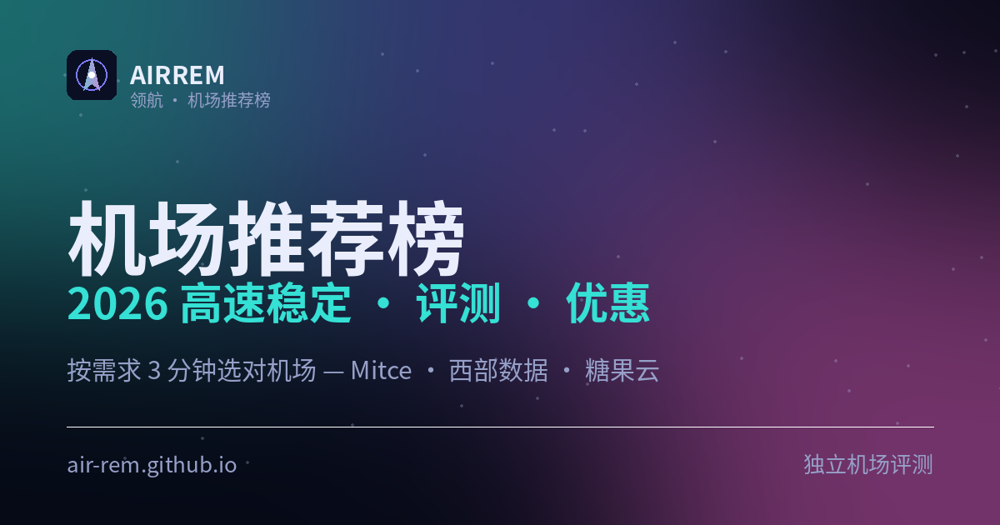

<h1 align="center">AIRREM 领航 · 机场推荐榜</h1>

独立的机场（科学上网）推荐与评测 · 按需求快速选对高速稳定机场 
线上站点：<a href="https://air-rem.github.io/">air-rem.github.io</a>

---

## 2026 精选机场榜单

按「综合稳定性 + 性价比 + 场景适配」精选。价格 / 优惠码可能随官网调整，请以各机场官网为准。

### 01. 西部数据 WestData  ·  「编辑推荐」

> 全 IEPL/IPLC 专线、多入口就近接入，稳定性口碑扎实的“二线机场佼佼者”，花多少买多少。

- **线路类型**：IEPL/IPLC 全专线
- **主要协议**：Trojan
- **流媒体解锁**：Netflix · Disney+ · ChatGPT
- **覆盖地区**：香港 · 日本 · 美国 · 德国 等
- **起步价**：¥17 起 / 200G（按量计费 ≈ 0.08 元/G）
- **最适合**：稳定专线党

老牌全专线里性价比很高的一家：线路稳、延迟低、按量灵活，把“稳定”放第一位的用户闭眼入门不亏。缺点是双向计流量、偶尔遭攻击，建议先月付试水。

**完整评测 → https://air-rem.github.io/westdata/**

### 02. Mitce  ·  「性价比之王」

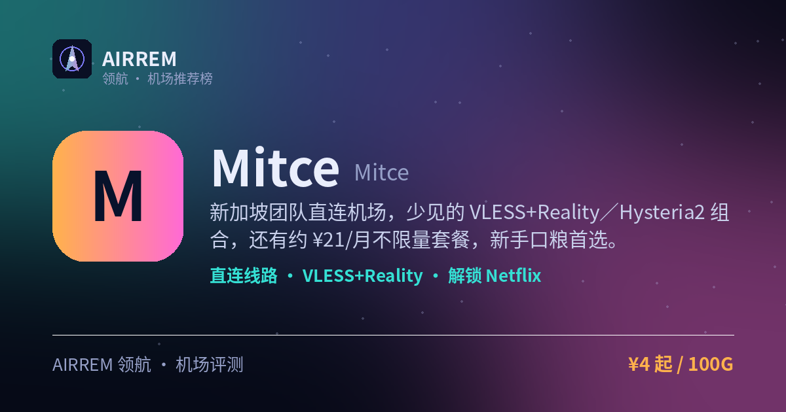

> 新加坡团队直连机场，少见的 VLESS+Reality／Hysteria2 组合，还有约 ¥21/月不限量套餐，新手口粮首选。

- **线路类型**：直连（部分 BGP 中转）
- **主要协议**：VLESS+Reality · Hysteria2
- **流媒体解锁**：Netflix · Disney+ · ChatGPT
- **覆盖地区**：德 · 英 · 港 · 日 · 韩 · 新 · 台 · 美（8 地）
- **起步价**：¥4 起 / 100G（低价包月 / 不限量套餐）
- **最适合**：性价比 / 新手

高性价比“口粮机场”的代表：便宜、有不限量套餐、Reality 抗封能力强，日常刷视频、挂 ChatGPT 很够用。直连线路晚高峰稳定性一般，对线路要求极高者可当备用梯子。

**完整评测 → https://air-rem.github.io/mitce/**

### 03. 糖果云 CandyCloud  ·  「影视新锐」

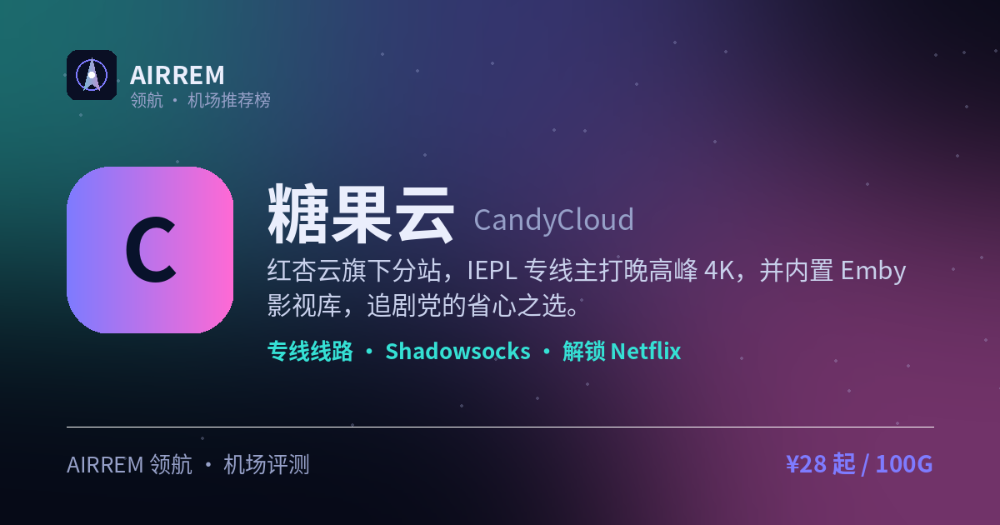

> 红杏云旗下分站，IEPL 专线主打晚高峰 4K，并内置 Emby 影视库，追剧党的省心之选。

- **线路类型**：IEPL 专线
- **主要协议**：Shadowsocks · V2Ray
- **流媒体解锁**：Netflix · ChatGPT · Emby 影视库
- **覆盖地区**：香港 · 日本 · 新加坡 等
- **起步价**：¥28 起 / 100G（包月 / 季付）
- **最适合**：影视 / 追剧

2025 年新锐，红杏云旗下分站，靠 IEPL 专线 + 内置 Emby 影视库主打“看剧体验”，晚高峰 4K 流畅。属于新机场，建议先月付小档验证稳定性，别一上来大额年付。

**完整评测 → https://air-rem.github.io/candycloud/**

### 04. 红杏云 HongXing  ·  「流媒体之选」

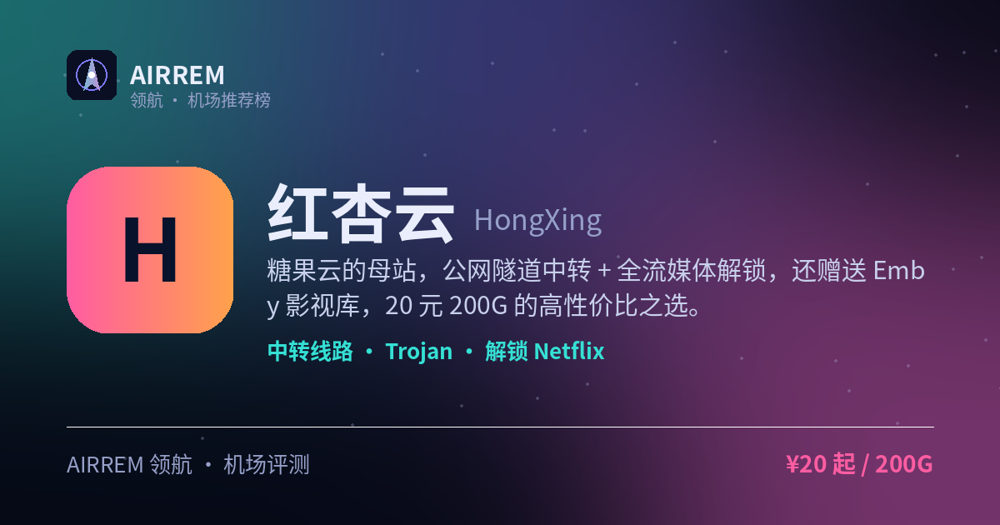

> 糖果云的母站，公网隧道中转 + 全流媒体解锁，还赠送 Emby 影视库，20 元 200G 的高性价比之选。

- **线路类型**：公网隧道中转
- **主要协议**：Trojan · Hysteria2
- **流媒体解锁**：Netflix · Disney+ · ChatGPT · Emby 影视库
- **覆盖地区**：香港 · 日本 · 台湾 · 新加坡 · 美国 等
- **起步价**：¥20 起 / 200G（包月 / 季付）
- **最适合**：流媒体 / 性价比

2024 年新站，把资源砸在流媒体解锁上：Netflix / Disney+ / ChatGPT 全解、4K 秒播、还赠送 Emby 影视库，价格也便宜。想要 IEPL 专线要去它的分站糖果云；新站建议先月付小额验证晚高峰。

**完整评测 → https://air-rem.github.io/hongxing/**

### 05. 牛逼 Niubi

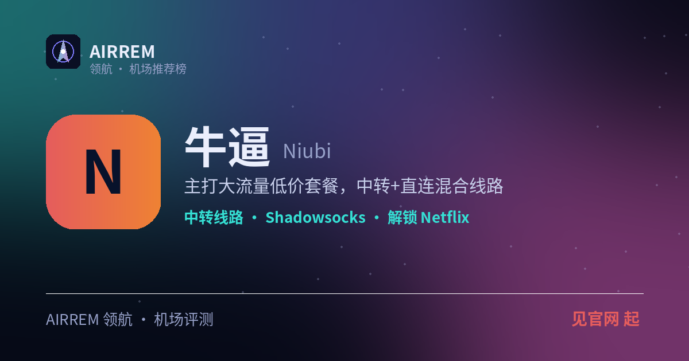

> 主打大流量低价套餐，中转+直连混合线路

- **线路类型**：公网中转 + 直连混合
- **主要协议**：Shadowsocks · VMess · Trojan
- **流媒体解锁**：Netflix · Disney+ · ChatGPT
- **覆盖地区**：香港 · 日本 · 新加坡 · 美国 等
- **起步价**：¥7.4 起 / 月（包月 / 按量）
- **最适合**：大流量党

以超大流量、低单价为卖点，日常刷剧下载性价比高；低价机场稳定性一般，建议先月付小额验证。

**完整评测 → https://air-rem.github.io/niubi/**

### 06. 良心云 Liangxin

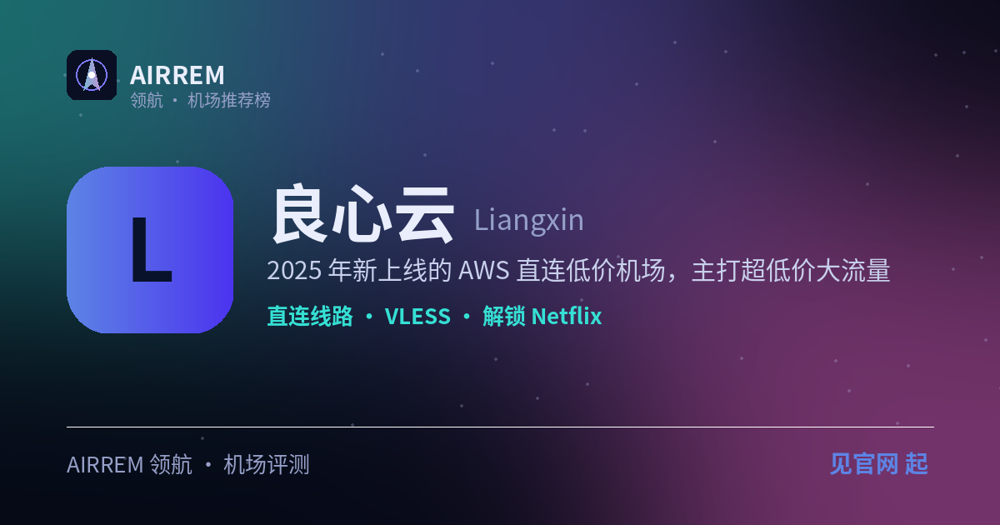

> 2025 年新上线的 AWS 直连低价机场，主打超低价大流量

- **线路类型**：AWS 直连线路
- **主要协议**：VLESS · Hysteria2
- **流媒体解锁**：Netflix · Disney+ · ChatGPT · TikTok
- **覆盖地区**：香港 · 日本 · 新加坡 · 韩国 · 美国 等
- **起步价**：¥2 起 / 月（包月 / 按量）
- **最适合**：低价尝鲜党

价格低、协议新（VLESS/Hy2），解锁反馈尚可；但运营时间短、直连机场普遍不稳定，强烈建议只用最低档月付观察，别直接年付。

**完整评测 → https://air-rem.github.io/liangxin/**

### 07. 守候 Shouhou

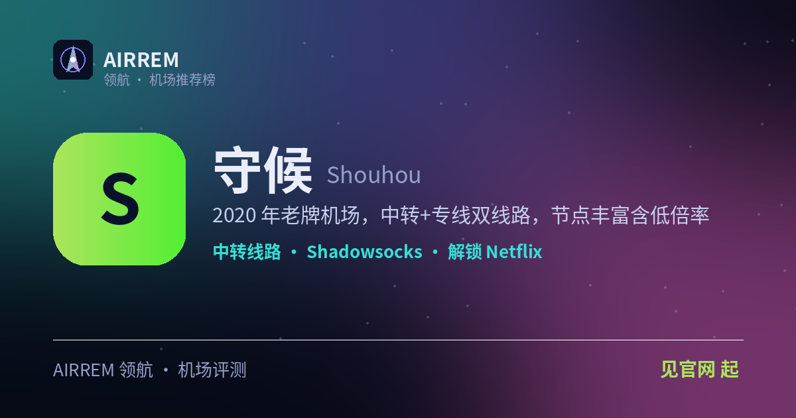

> 2020 年老牌机场，中转+专线双线路，节点丰富含低倍率

- **线路类型**：公网中转 + IPLC 专线
- **主要协议**：Shadowsocks
- **流媒体解锁**：Netflix · Disney+ · ChatGPT
- **覆盖地区**：香港 · 台湾 · 新加坡 · 美国 等 10+ 地区
- **起步价**：¥15 起 / 月（包月 / 包年）
- **最适合**：稳健老用户

运营时间较长，节点数量与入口丰富，提供低倍率节点省流量；即便老牌也建议先月付观察，再考虑年付。

**完整评测 → https://air-rem.github.io/shouhou/**

### 08. 69云 69Yun

> 2022 年专线中转机场，节点覆盖广（含冷门地区），常搭配 Emby

- **线路类型**：专线中转
- **主要协议**：Shadowsocks · VMess
- **流媒体解锁**：Netflix · Disney+ · HBO · ChatGPT
- **覆盖地区**：亚洲 · 欧美 · 含多个冷门地区
- **起步价**：¥9.9 起 / 月（包月 / 按量）
- **最适合**：冷门地区/备用

节点覆盖面广、冷门地区有优势，套餐多样，适合主力或备用；建议先低价月付验证晚高峰与解锁，再考虑长期。

**完整评测 → https://air-rem.github.io/yun69/**

### 09. 清风云 QingFeng

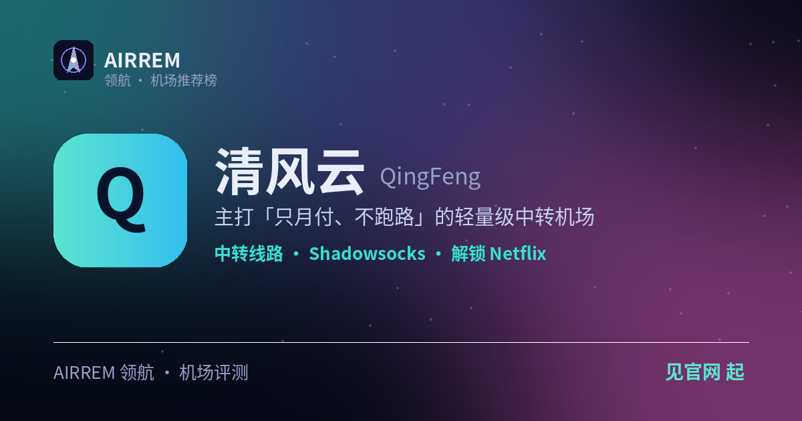

> 主打「只月付、不跑路」的轻量级中转机场

- **线路类型**：公网隧道中转
- **主要协议**：Shadowsocks · VLESS · Hysteria
- **流媒体解锁**：Netflix · ChatGPT
- **覆盖地区**：香港 · 日本 · 美国 等
- **起步价**：见官网 起 （包月 / 按量）
- **最适合**：新手轻量

定位入门轻量，公开评测较少，节点质量与稳定性建议自行小额验证；机场行业跑路风险普遍，不建议大额年付。

**完整评测 → https://air-rem.github.io/qingfeng/**

### 10. OuO

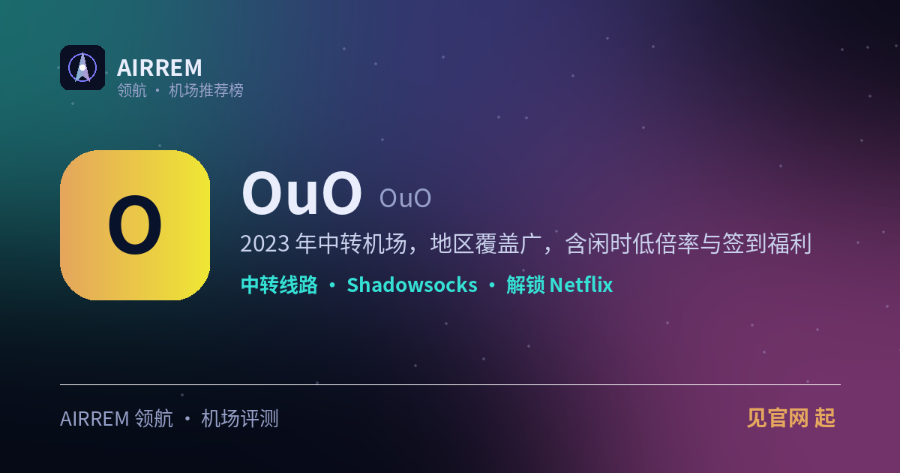

> 2023 年中转机场，地区覆盖广，含闲时低倍率与签到福利

- **线路类型**：公网隧道中转
- **主要协议**：Shadowsocks
- **流媒体解锁**：Netflix · Disney+ · YouTube · TikTok · ChatGPT
- **覆盖地区**：香港 · 日本 · 台湾 · 新加坡 · 美国 · 德国 · 英国 等
- **起步价**：¥10 起 / 月（包月 / 包季 / 包年）
- **最适合**：多地区解锁

节点地区多、解锁场景全，闲时低倍率是加分项；第三方口碑两极、部分反馈售后偏慢，建议先小额月付实测。

**完整评测 → https://air-rem.github.io/ouo/**

### 11. 好鸭 NiceDuck

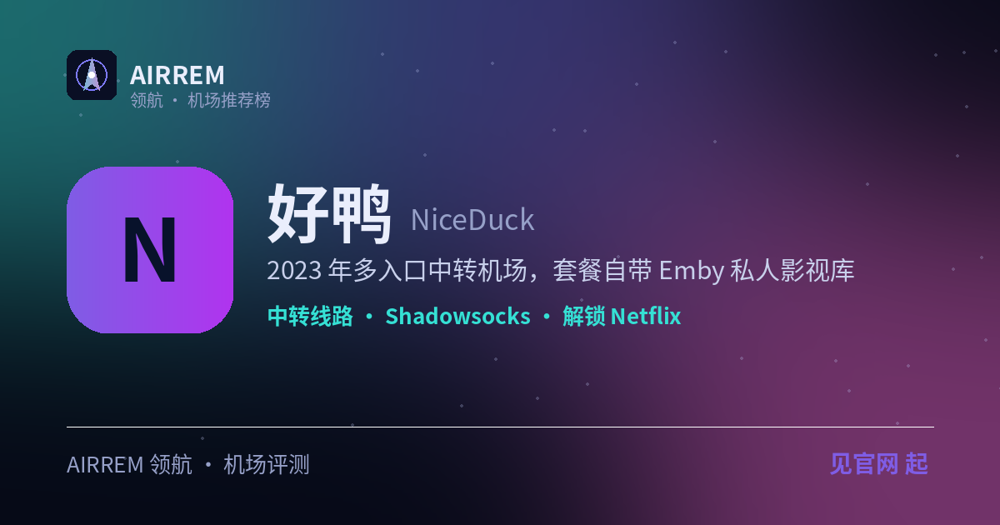

> 2023 年多入口中转机场，套餐自带 Emby 私人影视库

- **线路类型**：多入口隧道中转
- **主要协议**：Shadowsocks
- **流媒体解锁**：Netflix · Disney+ · YouTube · ChatGPT · Emby 影视库
- **覆盖地区**：香港 · 日本 · 台湾 · 新加坡 · 美国 · 韩国 · 澳门 等
- **起步价**：¥12 起 / 月（包月 / 包季 / 包年）
- **最适合**：追剧兼解锁

多入口中转国内接入较友好，绑定 Emby 影视库是差异化卖点，暂未见大规模跑路；协议仅 SS，仍建议先月付验证。

**完整评测 → https://air-rem.github.io/niceduck/**

### 12. 淘气兔 TaoQiTu

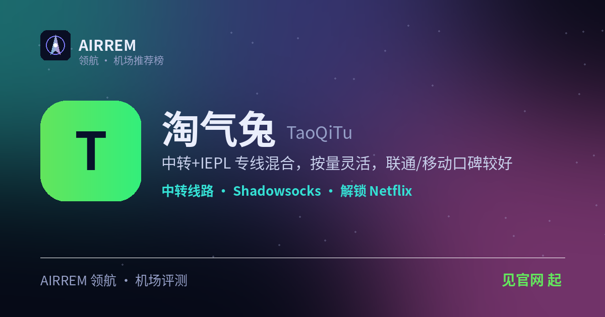

> 中转+IEPL 专线混合，按量灵活，联通/移动口碑较好

- **线路类型**：中转 + IEPL 专线
- **主要协议**：Shadowsocks · Trojan
- **流媒体解锁**：Netflix · ChatGPT
- **覆盖地区**：日本 · 香港 等（Amazon 中转为主）
- **起步价**：¥7.8 起 / 月（包月 / 按量）
- **最适合**：联通移动用户

有普通中转与 IEPL 专线（2 倍率）两种选择，性价比不错；但电信用户（尤其粤/苏）可能遇 QoS 限速，非电信用户优先，先小额验证。

**完整评测 → https://air-rem.github.io/taoqitu/**

### 13. 渔云 YuYun

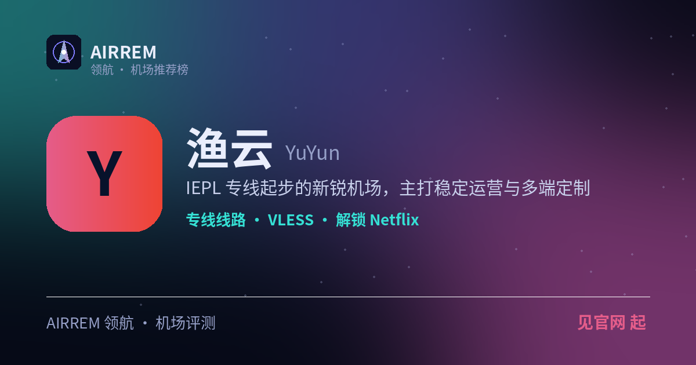

> IEPL 专线起步的新锐机场，主打稳定运营与多端定制

- **线路类型**：IEPL 专线 + 中转
- **主要协议**：VLESS · Hysteria2
- **流媒体解锁**：Netflix · Disney+ · ChatGPT
- **覆盖地区**：香港 · 日本 · 台湾 · 新加坡 · 美国 等
- **起步价**：¥9 起 / 月（包月 / 按量）
- **最适合**：长期稳定党

节点覆盖主流地区、协议较新，定位长期稳定而非低价冲量；作为新站建议先月付小额验证稳定性再长期用。

**完整评测 → https://air-rem.github.io/yuyun/**

### 14. 神龙 ShenLong

> 小众机场品类的一员，具体信息以官网公示为准

- **线路类型**：中转 / 专线（以官网为准）
- **主要协议**：Shadowsocks · VMess · Trojan
- **流媒体解锁**：Netflix · ChatGPT
- **覆盖地区**：以官网公布为准
- **起步价**：¥9 起 / 月（包月 / 按量）
- **最适合**：小众探索

目前公开可核实的评测资料较少，暂无法给出具体口碑；建议先通过官方渠道确认最新详情，并从月付小额开始验证。

**完整评测 → https://air-rem.github.io/shenlong/**

### 15. 一分机场 YiFen

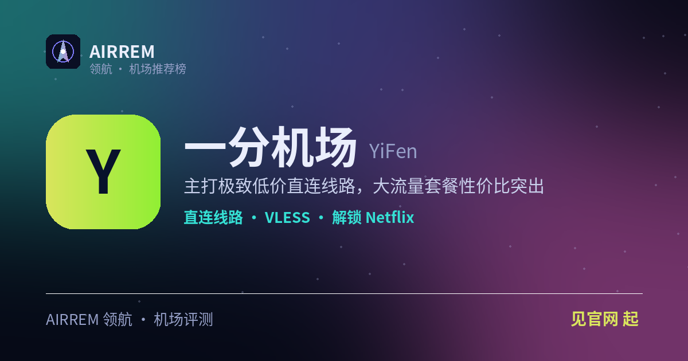

> 主打极致低价直连线路，大流量套餐性价比突出

- **线路类型**：直连（大厂云，无专线）
- **主要协议**：VLESS · Hysteria2
- **流媒体解锁**：Netflix · ChatGPT · bilibili
- **覆盖地区**：三网直连线路（地区以官网为准）
- **起步价**：¥2 起 / 月（包月 / 不限时）
- **最适合**：低价大流量

低价直连+大流量为卖点，价格档位丰富、日常性价比高；直连稳定性不及专线、晚高峰可能波动，先最低档月付验证再加量。

**完整评测 → https://air-rem.github.io/yifen/**

### 16. 流量光 LiuLiangGuang

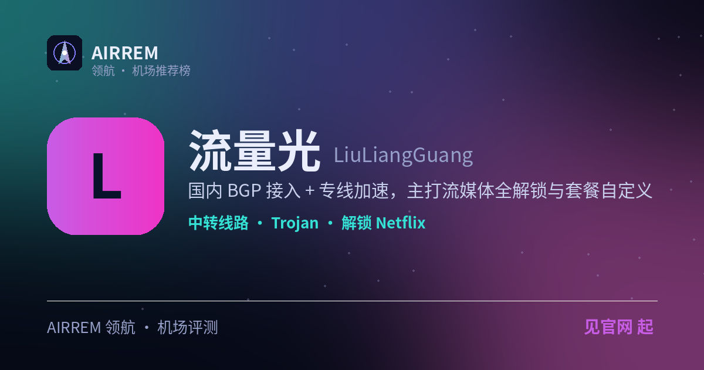

> 国内 BGP 接入 + 专线加速，主打流媒体全解锁与套餐自定义

- **线路类型**：BGP 中转 + 专线可选
- **主要协议**：Trojan · Shadowsocks
- **流媒体解锁**：Netflix · Disney+ · HBO · Spotify · TikTok · ChatGPT
- **覆盖地区**：主流地区 + 含冷门国家（以官网为准）
- **起步价**：¥9.9 起 / 月（包月 / 自定义）
- **最适合**：流媒体重度

节点多、解锁范围覆盖主流流媒体与 ChatGPT，支持流量/设备自定义，灵活性好；定位偏中高价位，先月付验证晚高峰再买大额。

**完整评测 → https://air-rem.github.io/llguang/**

### 17. 游隼云 YouSun

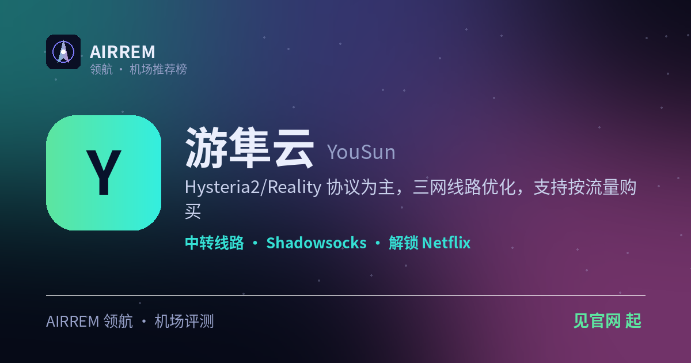

> Hysteria2/Reality 协议为主，三网线路优化，支持按流量购买

- **线路类型**：三网优化中转
- **主要协议**：Shadowsocks · Trojan · Hysteria2
- **流媒体解锁**：Netflix · Disney+ · ChatGPT
- **覆盖地区**：美国 · 日本 · 香港 · 台湾 · 新加坡 等
- **起步价**：¥0.03 起 / GB（包月 / 按流量）
- **最适合**：按量轻用户

主打大流量与多地区原生 IP，协议较新、抗封是卖点，按量适合用量不固定；节点数与真实速度建议自行小额测试。

**完整评测 → https://air-rem.github.io/yousun/**

### 18. 自由猫 FreeCat

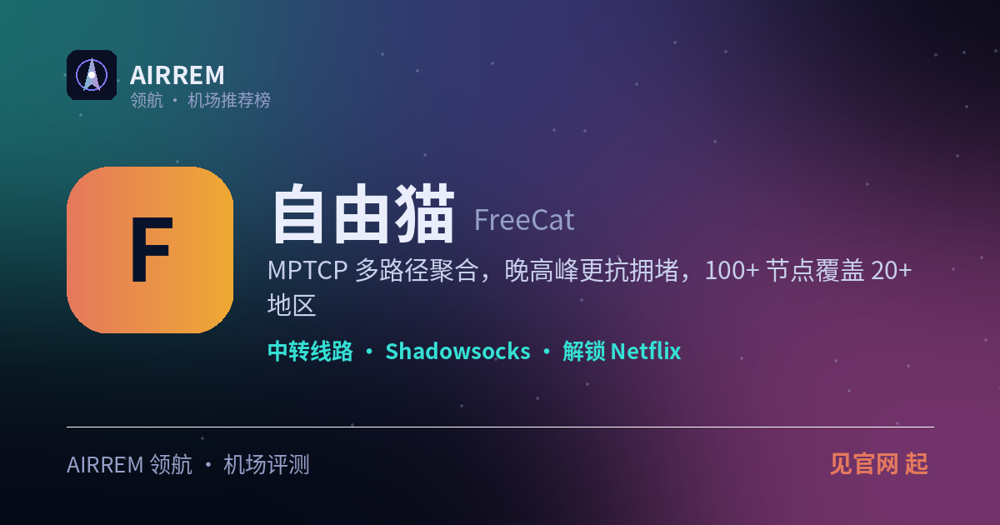

> MPTCP 多路径聚合，晚高峰更抗拥堵，100+ 节点覆盖 20+ 地区

- **线路类型**：MPTCP 多路径中转
- **主要协议**：Shadowsocks · Trojan · VLESS
- **流媒体解锁**：Netflix · Disney+ · ChatGPT
- **覆盖地区**：香港 · 日本 · 美国 · 新加坡 等 20+ 地区
- **起步价**：¥6 起 / 月（包月 / 包季 / 包年）
- **最适合**：日常主力

运营较久、技术路线（MPTCP 多路径）差异化明显，晚高峰稳定性是核心卖点；适配面广，价格与节点以官网为准。

**完整评测 → https://air-rem.github.io/freecat/**

### 19. 凌云加速 LingYun

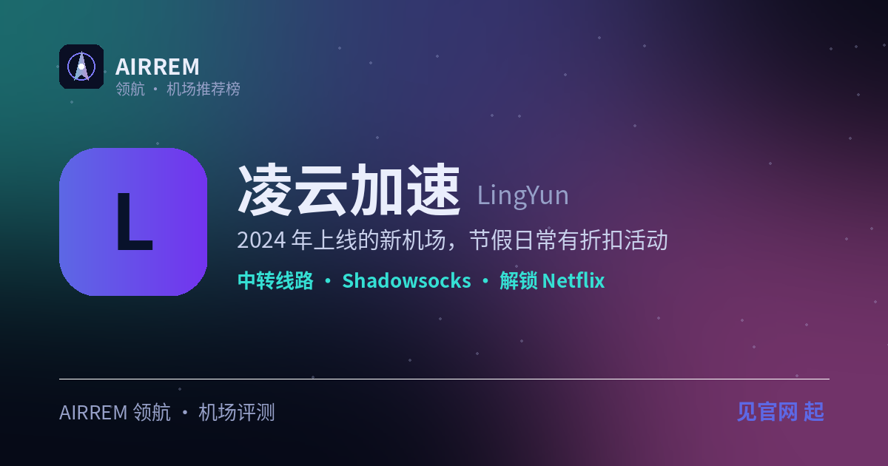

> 2024 年上线的新机场，节假日常有折扣活动

- **线路类型**：中转（线路细节未公开确认）
- **主要协议**：Shadowsocks · Trojan · VMess
- **流媒体解锁**：Netflix · Disney+ · ChatGPT
- **覆盖地区**：香港 · 日本 · 美国 等（以官网为准）
- **起步价**：¥10.9 起 / 月（包月 / 包季 / 包年）
- **最适合**：低价尝鲜

成立时间较短、公开评测有限，社区有个别关于稳定性/客服的负面反馈；建议只用最低档月付实测，确认稳定再续。

**完整评测 → https://air-rem.github.io/lingyun/**

### 20. 极速机场 JiSu

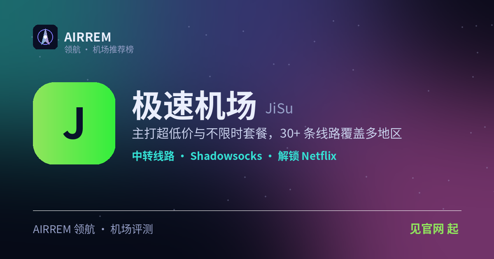

> 主打超低价与不限时套餐，30+ 条线路覆盖多地区

- **线路类型**：中转（多线路）
- **主要协议**：Shadowsocks · Trojan · Hysteria2
- **流媒体解锁**：Netflix · Disney+ · ChatGPT
- **覆盖地区**：香港 · 日本 · 新加坡 · 美国 等 30+ 线路
- **起步价**：见官网 起 （包月 / 按量 / 包年）
- **最适合**：预算优先入门

低价入门档，套餐偏大众化的按量+不限时组合，性价比是主卖点；低价机场抗风险能力有限，先小额月付验证。

**完整评测 → https://air-rem.github.io/jisu/**

### 21. 飞狗 FeiGou

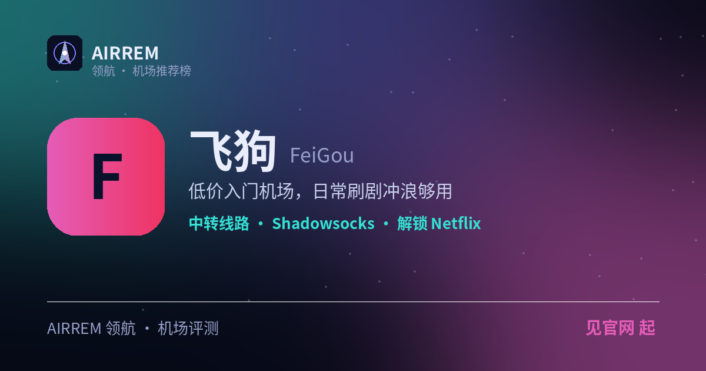

> 低价入门机场，日常刷剧冲浪够用

- **线路类型**：公网隧道中转
- **主要协议**：Shadowsocks · Trojan · VMess
- **流媒体解锁**：Netflix · YouTube · ChatGPT
- **覆盖地区**：香港 · 台湾 · 日本 · 美国 等
- **起步价**：见官网 起 （包月 / 包季）
- **最适合**：低价备用

低价走量入门机场，轻度使用性价比尚可；但公开信息显示历史上出现过域名失联、需另找新址的情况，稳定性存疑，不建议作唯一主力。

**完整评测 → https://air-rem.github.io/feigou/**

### 22. 雪山机场 XueShan

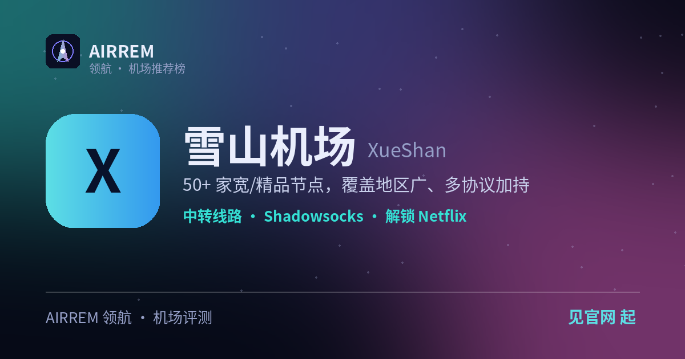

> 50+ 家宽/精品节点，覆盖地区广、多协议加持

- **线路类型**：家宽 / 中转线路
- **主要协议**：Shadowsocks · Trojan · Hysteria2 · VLESS
- **流媒体解锁**：Netflix · Disney+ · ChatGPT
- **覆盖地区**：香港 · 台湾 · 韩国 · 日本 · 新加坡 · 美国 · 德国 · 法国 · 俄罗斯 等
- **起步价**：¥9.9 起 / 月（包月 / 包年 / 流量包）
- **最适合**：日常全能

2025 年上线，主打节点多、覆盖广，家宽/中转配合多协议，适合视频/会议/ChatGPT 日常；作为较新机场，建议先小额付费观察稳定性。

**完整评测 → https://air-rem.github.io/xueshan/**

### 23. Hneko云机场 Hneko

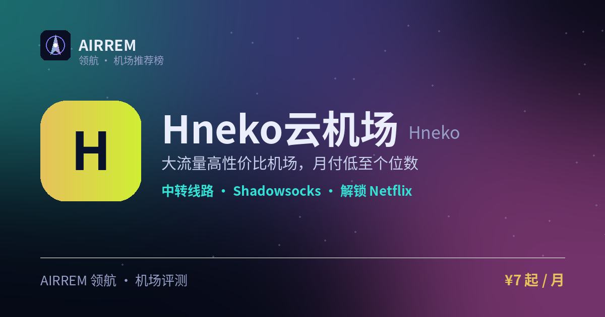

> 大流量高性价比机场，月付低至个位数

- **线路类型**：公网隧道中转
- **主要协议**：Shadowsocks · Trojan · VMess
- **流媒体解锁**：Netflix · ChatGPT
- **覆盖地区**：香港 · 日本 · 美国 等
- **起步价**：¥7 起 / 月（包月 / 包年 / 不限时）
- **最适合**：大流量党

以大流量、低价著称，套餐含月付/年付/不限时多种；据用户反馈节点稳定性时有波动、需留意订阅更新，建议先月付验证。

**完整评测 → https://air-rem.github.io/hneko/**

### 24. 顶级机场 DingJi

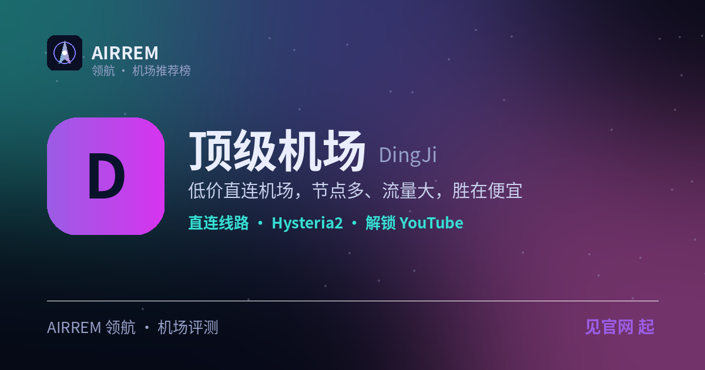

> 低价直连机场，节点多、流量大，胜在便宜

- **线路类型**：公网直连
- **主要协议**：Hysteria2 · VLESS
- **流媒体解锁**：YouTube · ChatGPT
- **覆盖地区**：美国 · 日本 · 香港 · 台湾 · 新加坡 · 韩国 等
- **起步价**：¥5 起 / 月（包月 / 按量）
- **最适合**：价格敏感重流量

走直连路线（Azure/AWS 入口），价格低、节点流量足，适合价格极敏感的大流量用户；速度受本地运营商影响大、节点 IP 更新频繁，不适合商务稳定场景。

**完整评测 → https://air-rem.github.io/dingji/**

### 25. 赔钱机场 PeiQian

> 低价大流量出名，自称「亏钱做服务」，适合备用防失联

- **线路类型**：全直连 / 部分中转
- **主要协议**：Shadowsocks · Trojan · VMess · VLESS · Hysteria2
- **流媒体解锁**：Netflix · ChatGPT · TikTok
- **覆盖地区**：香港 · 日本 · 美国 · 新加坡 等（含甲骨文云节点）
- **起步价**：¥1.99 起 / 月（包月流量包 / 不限时）
- **最适合**：极致低价备用

价格数一数二便宜、流量给得足，还有 0.1/0.01 超低倍率节点可薅；但全直连晚高峰与电信体验有限，建议只当备用、先月付小额验证。

**完整评测 → https://air-rem.github.io/peiqian/**

### 26. 卷王机场 JuanWang

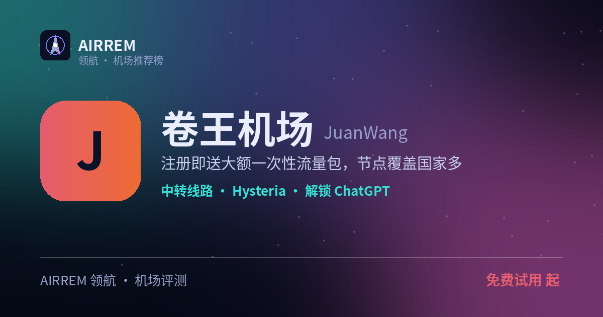

> 注册即送大额一次性流量包，节点覆盖国家多

- **线路类型**：公网隧道中转
- **主要协议**：Hysteria · Trojan · VLESS · VMess
- **流媒体解锁**：ChatGPT · TikTok
- **覆盖地区**：美国 · 香港 · 台湾 · 新加坡 · 日本 · 英国 · 加拿大 · 德国 等 11 地区
- **起步价**：免费试用 起 （注册送流量 / 付费套餐）
- **最适合**：免费试水

亮点是注册免费送的大流量套餐和覆盖 11 个地区的节点，适合零成本先体验；公开深度评测与长期数据较少，建议把免费套餐当体验装，满意再付费。

**完整评测 → https://air-rem.github.io/juanwang/**

### 27. 蛋挞机场 DanTa

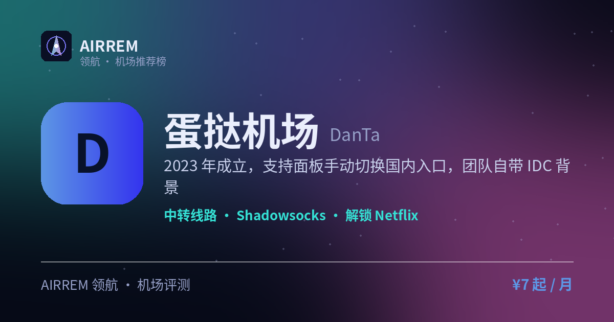

> 2023 年成立，支持面板手动切换国内入口，团队自带 IDC 背景

- **线路类型**：公网隧道中转 + IEPL 专线
- **主要协议**：Shadowsocks
- **流媒体解锁**：Netflix · Disney+ · YouTube Premium · ChatGPT · TikTok
- **覆盖地区**：港台新 · 日美韩 等，另有澳门等冷门节点
- **起步价**：¥7 起 / 月（包月 / 按量）
- **最适合**：多入口进阶

亮点是可在面板手动挑国内入口（同类少见），团队做 IDC 出身、后续加入 IEPL 专线，诚意在线；新站且换过站长，建议先免费试用/月付观察过渡期。

**完整评测 → https://air-rem.github.io/danta/**

### 28. 超实惠加速 ChaoShiHui

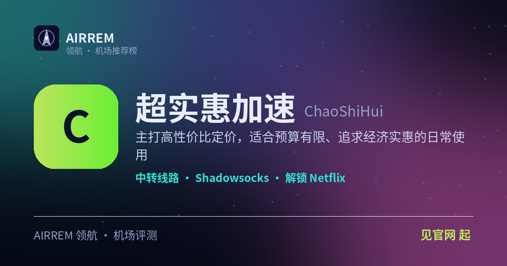

> 主打高性价比定价，适合预算有限、追求经济实惠的日常使用

- **线路类型**：中转 / 直连（以官网为准）
- **主要协议**：Shadowsocks · Trojan · VLESS
- **流媒体解锁**：Netflix · ChatGPT
- **覆盖地区**：香港 · 日本 · 美国 等（以官网为准）
- **起步价**：¥15 起 / 月（包月 / 按量）
- **最适合**：预算有限日常

从命名与定位看，主打「价格实惠、够用就好」，适合日常轻中度使用；公开独立评测与测速数据有限，具体套餐与稳定性以官网为准，先小额验证。

**完整评测 → https://air-rem.github.io/chaoshihui/**

## 快速对比

| 机场 | 线路类型 | 主要协议 | 解锁 | 起步价 | 最适合 |
| --- | --- | --- | --- | --- | --- |
| [西部数据](https://air-rem.github.io/westdata/) | IEPL/IPLC 全专线 | Trojan | Netflix · Disney+ · ChatGPT | ¥17 / 200G | 稳定专线党 |
| [Mitce](https://air-rem.github.io/mitce/) | 直连（部分 BGP 中转） | VLESS+Reality · Hysteria2 | Netflix · Disney+ · ChatGPT | ¥4 / 100G | 性价比 / 新手 |
| [糖果云](https://air-rem.github.io/candycloud/) | IEPL 专线 | Shadowsocks · V2Ray | Netflix · ChatGPT · Emby 影视库 | ¥28 / 100G | 影视 / 追剧 |
| [红杏云](https://air-rem.github.io/hongxing/) | 公网隧道中转 | Trojan · Hysteria2 | Netflix · Disney+ · ChatGPT · Emby 影视库 | ¥20 / 200G | 流媒体 / 性价比 |
| [牛逼](https://air-rem.github.io/niubi/) | 公网中转 + 直连混合 | Shadowsocks · VMess · Trojan | Netflix · Disney+ · ChatGPT | ¥7.4 / 月 | 大流量党 |
| [良心云](https://air-rem.github.io/liangxin/) | AWS 直连线路 | VLESS · Hysteria2 | Netflix · Disney+ · ChatGPT · TikTok | ¥2 / 月 | 低价尝鲜党 |
| [守候](https://air-rem.github.io/shouhou/) | 公网中转 + IPLC 专线 | Shadowsocks | Netflix · Disney+ · ChatGPT | ¥15 / 月 | 稳健老用户 |
| [69云](https://air-rem.github.io/yun69/) | 专线中转 | Shadowsocks · VMess | Netflix · Disney+ · HBO · ChatGPT | ¥9.9 / 月 | 冷门地区/备用 |
| [清风云](https://air-rem.github.io/qingfeng/) | 公网隧道中转 | Shadowsocks · VLESS · Hysteria | Netflix · ChatGPT | 见官网  | 新手轻量 |
| [OuO](https://air-rem.github.io/ouo/) | 公网隧道中转 | Shadowsocks | Netflix · Disney+ · YouTube · TikTok · ChatGPT | ¥10 / 月 | 多地区解锁 |
| [好鸭](https://air-rem.github.io/niceduck/) | 多入口隧道中转 | Shadowsocks | Netflix · Disney+ · YouTube · ChatGPT · Emby 影视库 | ¥12 / 月 | 追剧兼解锁 |
| [淘气兔](https://air-rem.github.io/taoqitu/) | 中转 + IEPL 专线 | Shadowsocks · Trojan | Netflix · ChatGPT | ¥7.8 / 月 | 联通移动用户 |
| [渔云](https://air-rem.github.io/yuyun/) | IEPL 专线 + 中转 | VLESS · Hysteria2 | Netflix · Disney+ · ChatGPT | ¥9 / 月 | 长期稳定党 |
| [神龙](https://air-rem.github.io/shenlong/) | 中转 / 专线（以官网为准） | Shadowsocks · VMess · Trojan | Netflix · ChatGPT | ¥9 / 月 | 小众探索 |
| [一分机场](https://air-rem.github.io/yifen/) | 直连（大厂云，无专线） | VLESS · Hysteria2 | Netflix · ChatGPT · bilibili | ¥2 / 月 | 低价大流量 |
| [流量光](https://air-rem.github.io/llguang/) | BGP 中转 + 专线可选 | Trojan · Shadowsocks | Netflix · Disney+ · HBO · Spotify · TikTok · ChatGPT | ¥9.9 / 月 | 流媒体重度 |
| [游隼云](https://air-rem.github.io/yousun/) | 三网优化中转 | Shadowsocks · Trojan · Hysteria2 | Netflix · Disney+ · ChatGPT | ¥0.03 / GB | 按量轻用户 |
| [自由猫](https://air-rem.github.io/freecat/) | MPTCP 多路径中转 | Shadowsocks · Trojan · VLESS | Netflix · Disney+ · ChatGPT | ¥6 / 月 | 日常主力 |
| [凌云加速](https://air-rem.github.io/lingyun/) | 中转（线路细节未公开确认） | Shadowsocks · Trojan · VMess | Netflix · Disney+ · ChatGPT | ¥10.9 / 月 | 低价尝鲜 |
| [极速机场](https://air-rem.github.io/jisu/) | 中转（多线路） | Shadowsocks · Trojan · Hysteria2 | Netflix · Disney+ · ChatGPT | 见官网  | 预算优先入门 |
| [飞狗](https://air-rem.github.io/feigou/) | 公网隧道中转 | Shadowsocks · Trojan · VMess | Netflix · YouTube · ChatGPT | 见官网  | 低价备用 |
| [雪山机场](https://air-rem.github.io/xueshan/) | 家宽 / 中转线路 | Shadowsocks · Trojan · Hysteria2 · VLESS | Netflix · Disney+ · ChatGPT | ¥9.9 / 月 | 日常全能 |
| [Hneko云机场](https://air-rem.github.io/hneko/) | 公网隧道中转 | Shadowsocks · Trojan · VMess | Netflix · ChatGPT | ¥7 / 月 | 大流量党 |
| [顶级机场](https://air-rem.github.io/dingji/) | 公网直连 | Hysteria2 · VLESS | YouTube · ChatGPT | ¥5 / 月 | 价格敏感重流量 |
| [赔钱机场](https://air-rem.github.io/peiqian/) | 全直连 / 部分中转 | Shadowsocks · Trojan · VMess · VLESS · Hysteria2 | Netflix · ChatGPT · TikTok | ¥1.99 / 月 | 极致低价备用 |
| [卷王机场](https://air-rem.github.io/juanwang/) | 公网隧道中转 | Hysteria · Trojan · VLESS · VMess | ChatGPT · TikTok | 免费试用  | 免费试水 |
| [蛋挞机场](https://air-rem.github.io/danta/) | 公网隧道中转 + IEPL 专线 | Shadowsocks | Netflix · Disney+ · YouTube Premium · ChatGPT · TikTok | ¥7 / 月 | 多入口进阶 |
| [超实惠加速](https://air-rem.github.io/chaoshihui/) | 中转 / 直连（以官网为准） | Shadowsocks · Trojan · VLESS | Netflix · ChatGPT | ¥15 / 月 | 预算有限日常 |

## 30 秒教你怎么选

- **要低延迟专线、常年稳定不掉线** → 选 [西部数据](https://air-rem.github.io/westdata/)
- **便宜稳定，日常刷视频 + 挂 AI** → 选 [Mitce](https://air-rem.github.io/mitce/)
- **重度追剧党，想要 Emby 影视库** → 选 [糖果云](https://air-rem.github.io/candycloud/)
- **便宜大流量看剧 + 全流媒体解锁** → 选 [红杏云](https://air-rem.github.io/hongxing/)

## 新手小提示

- 先买月付 / 小流量档验证稳定性，别一上来就大额年付。
- 老牌机场更稳；新机场先小档试水。
- 同时备用 2–3 家机场互为容灾，避免踩到跑路。
- 新协议（如 Hysteria2）要用支持它的客户端，否则导入会报错。

## 免责声明

本仓库与站点为第三方信息与推荐平台，非任何机场官方；页面内含推广链接，若你通过链接注册或购买，我们可能获得一定佣金，但不会增加你的任何成本。各机场的线路、价格、优惠码可能随时变动，请以对应官网实时信息为准。代理 / 加密技术的使用需遵守你所在国家或地区的法律法规，本站内容仅供学习与技术研究参考。

